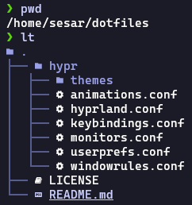

created at: 2024-04-08

read another readme: [nixos readme](./nixos_README.md)

basically... my dotfiles for my EndeavourOS + hyprland

So I installed my linux desktop with this repo: [https://github.com/prasanthrangan/hyprdots](https://github.com/prasanthrangan/hyprdots). Most of the settings were comming from that repo. I only modified a few, but I hope in the future I can expand this config further. Such as adding kitty and tmux config.

# In case I forgot how to setup

So I use stow to manage my dotfiles. At the time I create this documentation, I nearly forgot on how to setup it 💀. So I think this documentation will be minimal.

Anyways, you can always refer back to the first tutorial that I watched back then: [Tutorial by Dreams of Autonomy](https://www.youtube.com/watch?v=y6XCebnB9gs).

## The first step that you need to do

1. Install these packages
```sh
git
stow
```

2. Create a directory or simply clone this repository in `$HOME/<directory name>`, in my case it's `$HOME/dotfiles`



3. Anything that you want to put into the dotfiles directory must be the same structure as the $HOME directory

    So for example I want to store my .zshrc file in the dotfiles directory. Since .zshrc is located in the `$HOME/.zshrc`, then I need to put it on `dotfiles/.zshrc`.

    Am planning to find a way to create custom symlink tho. Really want to setup my dotfiles on directory-based level. So for example I have zshrc directory, I have kitty directory. Each directory contains scripts or dotfiles that I customized.

4. If you're done with the setup of the files that you want to store in the dotfiles, you need to run `stow .` in the dotfiles directory.
5. Additional info: you can also pass the `--adopt` flag if the files exist both in $HOME and dotfiles directory. It will move and overwrite the content of dotfiles directory from the $HOME directory.


# Future Plans

- [ ] Planning to migrate from oh-my-zsh to zinit, source: https://www.youtube.com/watch?v=ud7YxC33Z3w